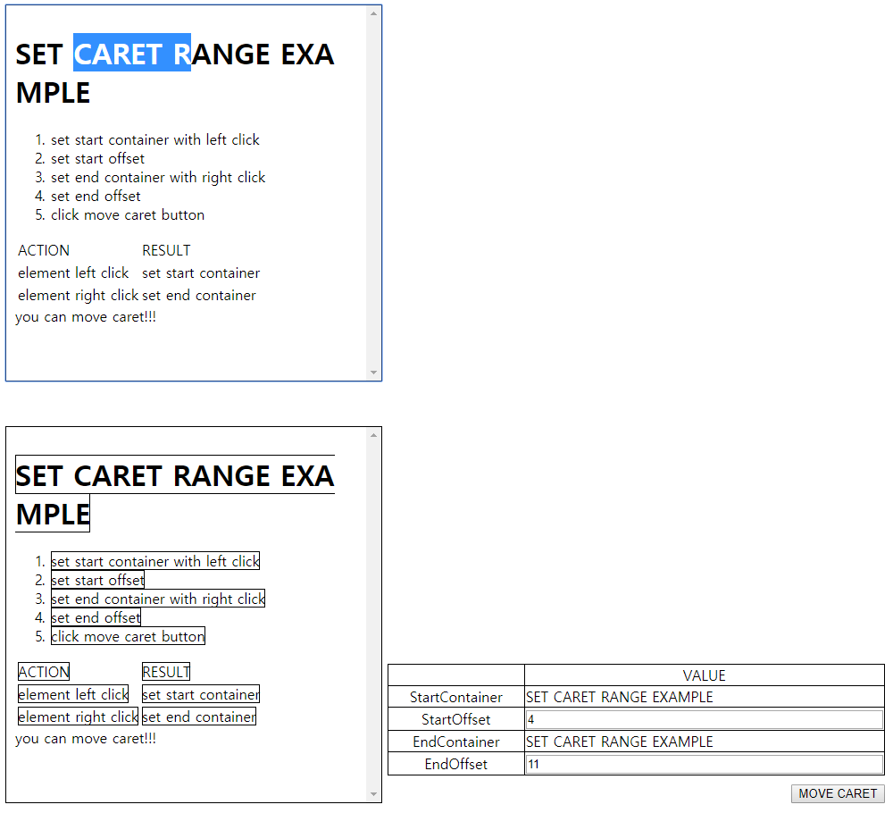

# Selection의 속성

| 속성 | 정보 |
| --- | --- |
| removeAllRanges | 설정 된 Range의 정보를 제거 |
| addRange | Selection에 특정 Range를 추가 |

# Range의 속성

| 속성 | 정보 |
| --- | --- |
| setStart | 시작 노드와 Offset 정보를 통해 Caret의 시작 지점을 설정 |
| setEnd | 끝 노드와 Offset 정보를 통해 Caret의 끝 지점을 설정 |

# Range 예제 이미지

