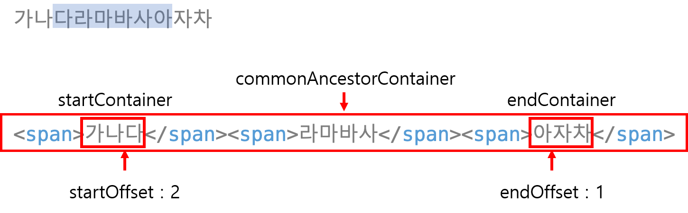

# window.getSelection()의 속성

| 속성 | 정보 |
| --- | --- |
| anchorNode | Caret의 시작 노드 |
| anchorOffset | 시작 노드에서 Caret의 Offset(위치) |
| baseNode | Caret의 시작 노드 |
| baseOffset | 시작 노드에서 Caret의 Offset(위치) |
| focusNode | Caret의 끝 노드 |
| focusOffset | 끝 노드에서 Caret의 Offset(위치) |
| extentNode | Caret의 끝 노드 |
| extentOffset | 끝 노드에서 Caret의 Offset(위치) |
| isCollapsed | Caret의 시작과 끝 동일 여부 |

